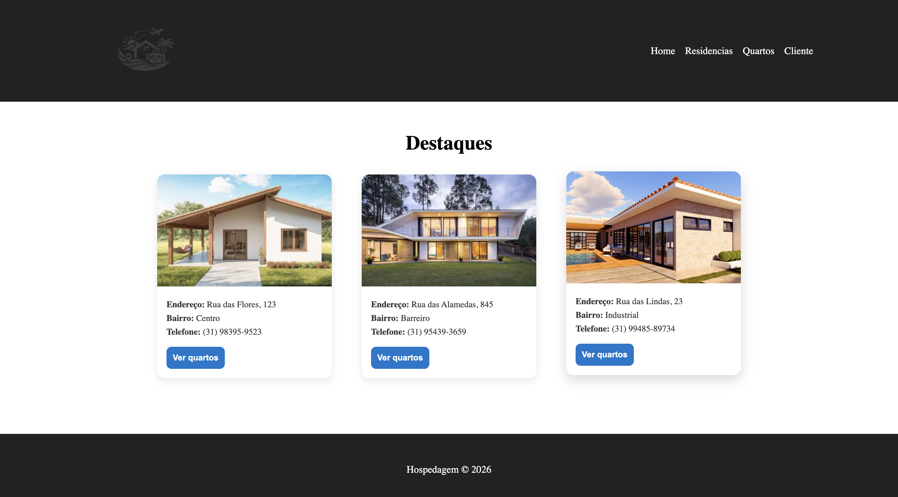
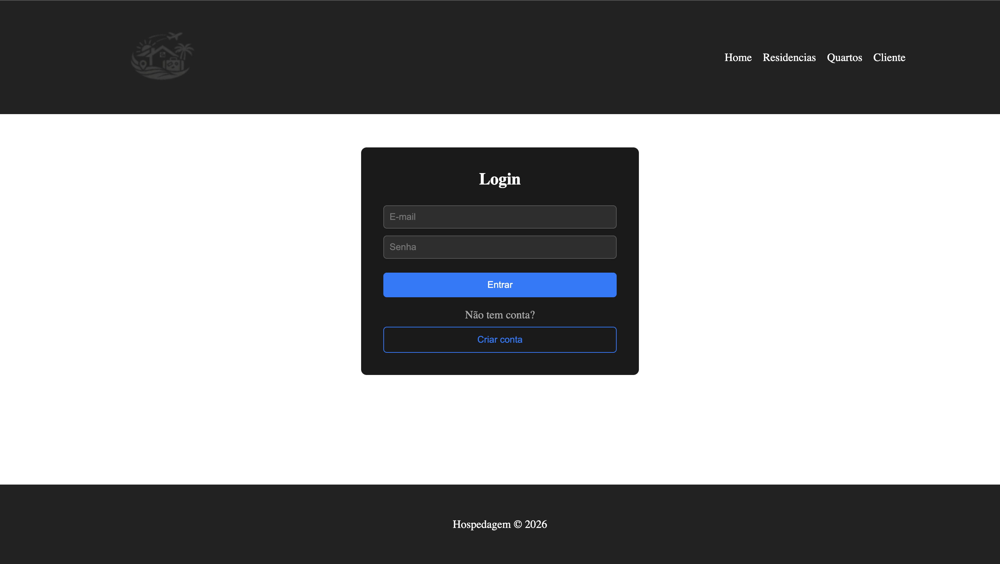
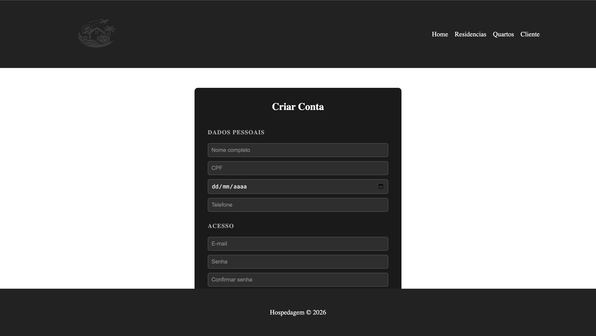
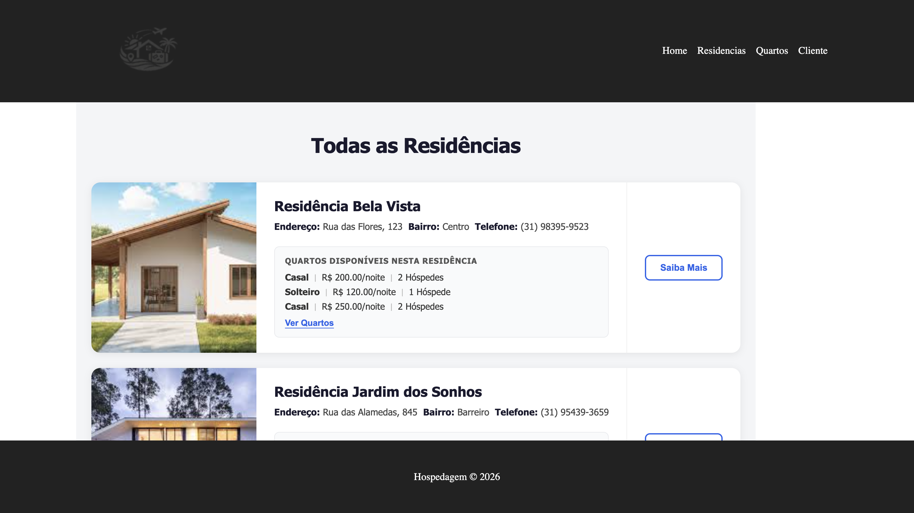
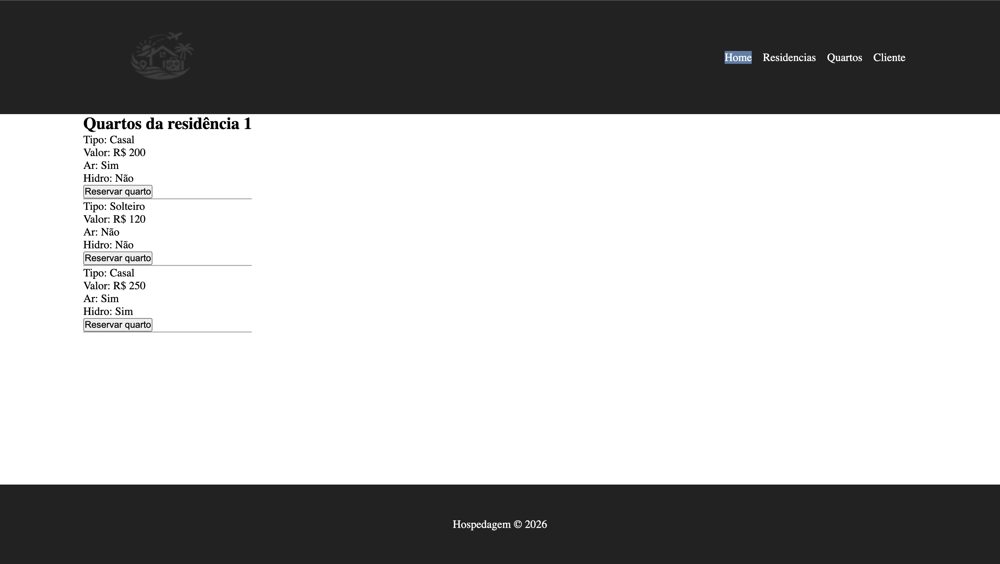
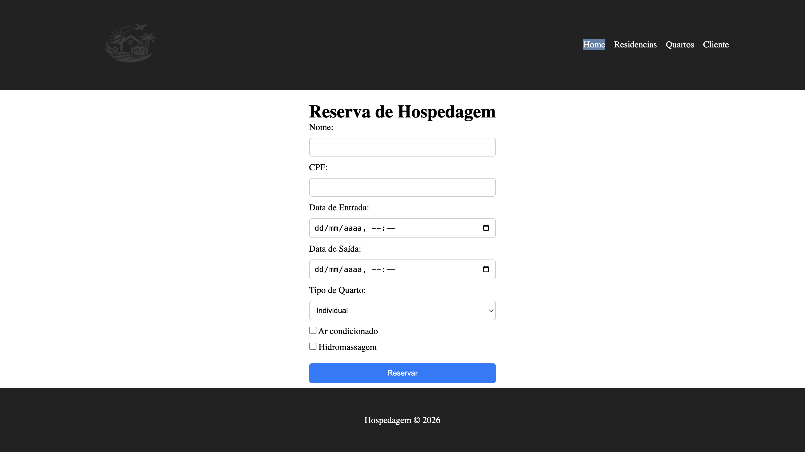

# Trabalho Prático - Sistema de Hospedagem
### 1. Sobre o Projeto
Este projeto implementa uma solução web de hospedagem, onde clientes podem buscar residências, visualizar quartos e realizar reservas de forma intuitiva e segura.

O sistema está sendo desenvolvido na disciplina de Programação Modular, com foco em:

• Modelagem orientada a objetos

• Arquitetura em camadas (Controller, Service, Repository, Model)

• API REST com Spring Boot

• Persistência em banco de dados (MySQL)

• Testes automatizados

• Aplicação de padrões de projeto
### 2. Professor: 
Glender Brás

### 3. Integrantes do Grupo
• _Eli Júnior Domingos Dias_

• _Guilherme Pereira Bittencourt_

• _Luiz Eduardo Campos Silva_

• _Raphael Thierry Coelho_

### 4. Como Executar o Projeto
Instale as dependências:

**npm install**

Inicie o ambiente de desenvolvimento:

**npm run dev**

### 5. Protótipo: telas sem funcionalidade

#### Home

#### Login

#### Cadastro

#### Residências

#### Quarto

#### Reserva

